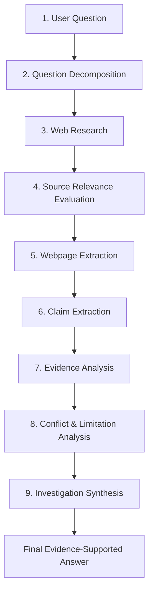

<div align="center">

# 🔭 DeepScout

**Evidence-Driven Investigation Agent**

Research questions across multiple sources, connect findings to evidence, surface disagreements and limitations, and produce a source-backed final answer.

[](https://nodejs.org/)
[](https://react.dev/)
[](https://expressjs.com/)
[](https://vitejs.dev/)
[](https://tailwindcss.com/)
[](https://www.mongodb.com/)

</div>

---

## 📌 Table of Contents

- [Overview](#-overview)
- [Why DeepScout?](#-why-deepscout)
- [What DeepScout Gives You](#-what-deepscout-gives-you)
- [How It Works](#-how-it-works)
- [The 9-Stage Investigation Pipeline](#-the-9-stage-investigation-pipeline)
- [Key Features](#-key-features)
- [Use Cases](#-use-cases)
- [Architecture & Tech Stack](#-architecture--tech-stack)
- [AI & Evidence Architecture](#-ai--evidence-architecture)
- [Repository Structure](#-repository-structure)
- [Prerequisites & Environment](#-prerequisites--environment)
- [Quick Start](#-quick-start)
- [API Overview](#-api-overview)
- [Investigation Data](#-investigation-data)
- [Current Status](#-current-status)
- [Security](#-security)
- [License](#-license)

---

## 💡 Overview

DeepScout is an **evidence-driven research and investigation system** built for questions that require more than a single generated AI response.

Instead of asking an LLM to answer a complex inquiry directly from memory, DeepScout transforms the question into a structured research investigation. It breaks the question into focused research queries, searches external sources, evaluates their relevance, extracts full webpage text, identifies atomic claims with contextual scopes, analyzes empirical consensus and conflicts, and synthesizes a supported final answer with complete citation lineage.

### The Core Idea

```text
Traditional AI interaction
--------------------------
Question
   ↓
Generated answer
```

```text
DeepScout Investigation
-----------------------
Question
   ↓
Research questions (Decomposition)
   ↓
Web research (Multi-source search)
   ↓
Relevant sources (Semantic evaluation)
   ↓
Webpage evidence (DOM body extraction)
   ↓
Claims (Scoped atomic facts)
   ↓
Evidence analysis (Cross-claim synthesis)
   ↓
Conflicts / conditions / limitations (Divergence analysis)
   ↓
Evidence-supported final answer
```

DeepScout makes the **research behind an answer visible and inspectable**, rather than presenting only an unverified final summary.

> **DeepScout does not claim to make research infallible. It is engineered to reduce unsupported conclusions by grounding findings in researched sources, preserving study scopes, and transparently exposing conflicting evidence and limitations.**

---

## ❓ Why DeepScout?

For nuanced, empirical, or open-ended questions, a single conversational AI answer often conceals critical research context:

- Where did the facts originate?
- Which specific sources support which statements?
- Do reputable studies disagree on the findings?
- Are comparative studies evaluating the same populations, metrics, or timeframes?
- Under what specific conditions does a finding hold?
- Was relevant information blocked, paywalled, or unavailable during the search?

DeepScout treats user inquiries as an **investigation** rather than a text-completion task.

The central goal:

> **Help users understand both the answer and the empirical evidence behind it.**

---

## 🎯 What DeepScout Gives You

When an investigation completes, DeepScout delivers a multi-dimensional research dossier rather than just a concluding paragraph:

1. **Final Answer**  
   A direct, synthesized answer answering the core question, strictly derived from the extracted evidence.
2. **Key Findings**  
   The primary empirical takeaways identified across researched sources, with explicit links to supporting claim and source IDs.
3. **Evidence Connections & Citations**  
   A traceable audit trail connecting every finding and claim back to verified URLs, publisher domains, and publication dates.
4. **Conflicting Evidence**  
   Explicit identification of true contradictory findings where comparable studies examine the same conditions yet reach opposing conclusions.
5. **Conditions & Nuances (Comparability Notes)**  
   Contextual explanations of why findings diverge without directly contradicting each other, highlighting differences in:
   - Population or sample demographics
   - Outcomes or metrics being evaluated
   - Task types (e.g., routine execution vs. creative innovation)
   - Analytical levels (individual vs. organizational vs. industry macro)
   - Timeframes (short-term pilot vs. multi-year sustained outcome)
   - Measurement approach (objective output vs. self-reported survey)
6. **Research Limitations**  
   Full transparency on incomplete, weak, or failed parts of the pipeline, including unreadable webpages, search query timeouts, or insufficient evidence.

```text
What the evidence says
         +
What supports the findings
         +
Where evidence differs
         +
What conditions matter
         +
What limitations remain
```

---

## 🔄 How It Works

DeepScout executes an automated research lifecycle orchestrated by the backend and tracked live in the client UI:



---

## 🔬 The 9-Stage Investigation Pipeline

The conceptual 9-stage pipeline maps directly to the active codebase in [`server/src/AI/`](file:///e:/WebDevelopMent%20Project/DeepScout/Server/src/AI) and [`server/src/Controllers/`](file:///e:/WebDevelopMent%20Project/DeepScout/Server/src/Controllers):

| # | Conceptual Stage | Active Code Implementation | Primary Responsibility |
|---|---|---|---|
| **1** | **User Question** | [`investigation.controller.js`](file:///e:/WebDevelopMent%20Project/DeepScout/Server/src/Controllers/investigation.controller.js) | Validates question length and corpus type (`web`, `news`, or `scholar`). Enforces rate limits and authentication. |
| **2** | **Question Decomposition** | [`Graph.js`](file:///e:/WebDevelopMent%20Project/DeepScout/Server/src/AI/Graph.js) (`decomposeQuestion`) | Breaks the prompt into 3–5 search queries across separate outcome dimensions. Explicitly adds longitudinal queries for long-term/sustained questions. |
| **3** | **Web Research** | [`Researcher.js`](file:///e:/WebDevelopMent%20Project/DeepScout/Server/src/AI/Researcher.js) (`researchAll`, `researchQuestion`) | Queries search engines with stop-word cleaning. Uses **SerpAPI** (Google Search/Scholar/News) with automatic fallback to **Tavily Search API**. |
| **4** | **Source Relevance** | [`SemanticRelevanceEvaluator.js`](file:///e:/WebDevelopMent%20Project/DeepScout/Server/src/AI/SemanticRelevanceEvaluator.js) (`evaluateSources`) | Uses LLM JSON scoring to evaluate snippet relevance (0–100 score + reason). Controller deduplicates overlapping URLs across sub-questions. |
| **5** | **Webpage Extraction** | [`WebpageExtractor.js`](file:///e:/WebDevelopMent%20Project/DeepScout/Server/src/AI/WebpageExtractor.js) (`extractWebpages`) | Fetches full webpage HTML using **Cheerio**, stripping navigation, ads, and scripts. If blocked (403, captcha), falls back to verified search snippets (`extractionStatus: "fallback"`). |
| **6** | **Claim Extraction** | [`ClaimExtractor.js`](file:///e:/WebDevelopMent%20Project/DeepScout/Server/src/AI/ClaimExtractor.js) (`extractClaims`) | Batches source content (max 4,500 chars). Extracts atomic claims tagged with claim type, strength, and 12-dimensional contextual scopes. |
| **7** | **Evidence Analysis** | [`EvidenceAnalyzer.js`](file:///e:/WebDevelopMent%20Project/DeepScout/Server/src/AI/EvidenceAnalyzer.js) (`analyzeEvidence`) | Synthesizes claims into high-level empirical findings while preventing overgeneralization across levels, populations, or measurement types. |
| **8** | **Conflicts & Limitations** | [`EvidenceAnalyzer.js`](file:///e:/WebDevelopMent%20Project/DeepScout/Server/src/AI/EvidenceAnalyzer.js) (`classifyDivergence`) | Separates genuine empirical contradictions from non-contradictory comparability notes (`different_outcome`, `different_population`, `different_measurement`). Logs pipeline failures. |
| **9** | **Investigation Synthesis** | [`EvidenceAnalyzer.js`](file:///e:/WebDevelopMent%20Project/DeepScout/Server/src/AI/EvidenceAnalyzer.js) + [`investigation.controller.js`](file:///e:/WebDevelopMent%20Project/DeepScout/Server/src/Controllers/investigation.controller.js) | Formulates conclusion sentence ordering (e.g. leading with temporal limitations), maps claim/source citations, persists to MongoDB, and returns the response dossier. |

> **Note on Orchestration:** The pipeline is currently orchestrated imperatively inside [`investigation.controller.js`](file:///e:/WebDevelopMent%20Project/DeepScout/Server/src/Controllers/investigation.controller.js). While `@langchain/langgraph` is installed in `server/package.json`, the active workflow runs through the dedicated AI service modules listed above.

---

## ✨ Key Features

- **Structured Question Decomposition**: Generates multi-angle search queries exploring trade-offs, short-term vs. sustained impacts, and distinct outcome metrics.
- **Dual-Engine Search Fallback**: Executes web, news, and academic queries via SerpAPI, automatically switching to Tavily Search if SerpAPI returns empty results or encounters errors.
- **Semantic Relevance Scoring**: Grades retrieved search results with an LLM-evaluated score and explanation before scraping.
- **Resilient Webpage Extraction**: Extracts semantic page bodies with Cheerio, degrading gracefully to verified search snippets if anti-bot protections block retrieval.
- **Context-Scoped Claim Extraction**: Preserves empirical boundaries by tagging extracted claims with analytical levels, study designs, sample demographics, and measurement types.
- **Evidence Divergence Classifier**: Distinguishes between true empirical conflicts and non-contradictory differences (e.g., call-center task output vs. creative team collaboration).
- **Audit Trail & Provenance**: Renders an interactive investigation trail linking each finding back to the underlying claims, sources, and sub-questions.
- **Limitation Telemetry**: Tracks search failures, extraction failures, and claim extraction failures, explicitly alerting the user to partial investigations.
- **Authentication & History**: User registration and login using JWT in HTTP-only cookies, bcrypt password hashing, and MongoDB persistence.

---

## 🧪 Use Cases

DeepScout is suited for questions where evidence is scattered, multifaceted, or potentially contradictory:

- **Technology & Architecture Decisions**: Comparing frameworks, databases, or cloud strategies across real-world benchmarks and case studies.
- **Organizational & Workplace Policies**: Investigating empirical studies on hybrid schedules, 4-day workweeks, or remote worker productivity.
- **Scientific & Educational Inquiries**: Summarizing academic consensus and study conditions on health, cognitive science, or environmental topics.
- **Fact-Checking & Claim Verification**: Analyzing conflicting public claims by examining source quality, methodology, and study scopes.
- **Market & Industry Research**: Exploring industry shifts while separating macro-level economic indicators from company-specific survey data.

*Disclaimer: DeepScout is an automated research aid and is not a substitute for certified medical, legal, or financial professional counsel.*

---

## 🏗️ Architecture & Tech Stack

| Layer | Technology | Version | Purpose in DeepScout |
|---|---|---|---|
| **Frontend Framework** | React | `^19.2.8` | Component-based interactive UI |
| **Frontend Build Tool** | Vite | `^8.3.0` | High-speed ESM development and production build |
| **Styling** | Tailwind CSS | `^4.3.3` | Dark-theme utilities and responsive layout |
| **Routing** | React Router DOM | `^7.18.4` | Client-side routing with protected view wrappers |
| **Icons & Effects** | Lucide React / OGL | `^1.47.0` / `^1.0.11` | Interface icons and ambient WebGL ray shaders |
| **Backend Runtime** | Node.js (ESM) | `v18+` | Server runtime environment |
| **Server Framework** | Express | `^5.2.1` | REST API, route handlers, and middleware |
| **AI Inference** | Groq API (`GroqClient.js`) | API | Low-latency LLM inference (JSON mode) |
| **Primary Search** | SerpAPI (`serpapi`) | `^2.2.1` | Google Search, News, and Scholar indexing |
| **Fallback Search** | Tavily Search API | REST | Automated fallback search when SerpAPI fails |
| **HTML Parsing** | Cheerio | `^1.2.0` | Server-side DOM parsing and article body scraping |
| **Database & ODM** | MongoDB / Mongoose | `^9.10.1` | User authentication and investigation storage |
| **Security & Utilities** | JWT / bcryptjs / Helmet | `^9.0.3` / `^3.0.3` / `^8.3.0` | Token auth, password hashing, and secure HTTP headers |
| **Rate Limiting** | express-rate-limit | `^8.7.0` | Brute-force and DDoS protection for auth routes |

> **Installed vs. Active Dependencies:** Packages such as `@google/genai` and `ollama` in `server/package.json` reflect historical experiments. The active production LLM provider is **Groq** via `GroqClient.js`.

---

## 🧠 AI & Evidence Architecture

DeepScout employs targeted LLM calls for specific cognitive sub-tasks rather than a single massive end-to-end prompt:

```text
Specialized LLM Calls
---------------------
1. Decompose Question       -> Generates focused sub-questions (Graph.js)
2. Score Relevance          -> Rates search snippets 0-100 (SemanticRelevanceEvaluator.js)
3. Extract Scoped Claims    -> Parses text into atomic, scoped claims (ClaimExtractor.js)
4. Analyze Evidence         -> Identifies findings, conditions, and conflicts (EvidenceAnalyzer.js)
```

### The Provenance Chain

```text
Source (URL / Publisher)
   ↓
Webpage Content (Scraped body or snippet fallback)
   ↓
Extracted Claim (Tagged with type, strength, and 12D scope)
   ↓
Key Finding / Condition (Cited with claimIds and sourceIds)
   ↓
Final Synthesis (Supported answer with provenance)
```

### Scope Preservation Guardrails

To prevent typical LLM generalization errors, `EvidenceAnalyzer.js` enforces strict scope boundaries:
- **Analytical Level**: Industry-wide trends (e.g., national BLS data) cannot be described as individual employee performance.
- **Measurement Type**: Self-reported employee sentiment surveys cannot be cited as objective quantitative output.
- **Population**: Studies on routine call-center agents cannot be generalized to creative software engineering teams.
- **Timeframe**: Six-month trial results cannot be labeled as sustained long-term effects.

---

## 📂 Repository Structure

```text
DeepScout/
├── client/                             # React 19 + Vite frontend
│   ├── public/                         # Favicon and static SVGs
│   ├── src/
│   │   ├── api/                        # Client API wrappers (auth.js, investigations.js, client.js)
│   │   ├── components/
│   │   │   ├── auth/                   # LoginForm.jsx, RegisterForm.jsx
│   │   │   ├── investigation/          # 9-stage investigation UI components
│   │   │   │   ├── ComparabilitySection.jsx  # Methodological & contextual divergences
│   │   │   │   ├── ConclusionSection.jsx     # Grounded evidence synthesis
│   │   │   │   ├── ConditionsSection.jsx     # Modifying factors & boundary conditions
│   │   │   │   ├── ConflictsSection.jsx      # True empirical contradictions
│   │   │   │   ├── FindingsSection.jsx       # Key findings with citation links
│   │   │   │   ├── InvestigationTrail.jsx    # Visual research audit trail
│   │   │   │   ├── ProgressTracker.jsx       # Investigation telemetry indicator
│   │   │   │   ├── QuestionInput.jsx         # Search bar & corpus selector
│   │   │   │   ├── ResearchLimitations.jsx   # Missing sources & failure telemetry
│   │   │   │   ├── ResultView.jsx            # Composite dossier display
│   │   │   │   ├── SourceDetailDrawer.jsx    # Slide-over source inspector
│   │   │   │   ├── SourceFavicon.jsx         # Domain favicon resolver
│   │   │   │   ├── SourcesSection.jsx        # Bibliographic source directory
│   │   │   │   └── SummarySection.jsx        # High-level summary view
│   │   │   ├── layout/                 # AppShell.jsx, TopBar.jsx, Sidebar.jsx, MobileDrawer.jsx
│   │   │   └── ui/                     # Badges, Skeletons, SideRays.jsx, DeepScoutLogo.jsx
│   │   ├── context/                    # AuthContext.jsx, InvestigationContext.jsx
│   │   ├── pages/                      # LandingPage.jsx, AppPage.jsx, LoginPage.jsx, RegisterPage.jsx
│   │   ├── routes/                     # ProtectedRoute.jsx
│   │   ├── utils/                      # sourceIcons.js, date.js
│   │   ├── App.jsx                     # Root application routing
│   │   ├── index.css                   # Global Tailwind v4 theme tokens
│   │   └── main.jsx                    # React DOM entry point
│   ├── package.json
│   └── vite.config.js                  # Vite config with /api and /health reverse proxies
│
├── server/                             # Express backend + AI research pipeline
│   ├── src/
│   │   ├── AI/                         # Pipeline analysis modules
│   │   │   ├── ClaimExtractor.js             # Stage 6: Claim extraction & scope normalization
│   │   │   ├── EvidenceAnalyzer.js           # Stages 7 & 8: Findings, divergence & synthesis
│   │   │   ├── Graph.js                      # Stage 2: Question decomposition
│   │   │   ├── GroqClient.js                 # Groq API client with backoff and JSON repair
│   │   │   ├── Researcher.js                 # Stage 3: SerpAPI & Tavily search orchestration
│   │   │   ├── SemanticRelevanceEvaluator.js # Stage 4: Semantic relevance scoring
│   │   │   └── WebpageExtractor.js           # Stage 5: Cheerio full-page body scraping
│   │   ├── Controllers/                # investigation.controller.js, auth.controller.js
│   │   ├── Middleware/                 # auth.middleware.js, rateLimiter.js
│   │   ├── Model/                      # userModel.js, investigationModel.js
│   │   ├── Routes/                     # investigation.routes.js, auth.routes.js
│   │   ├── app.js                      # Express configuration, security headers, CORS
│   │   ├── db.js                       # MongoDB connection with local fallback
│   │   └── server.js                   # Application entry point (Port 3000)
│   ├── .env.example                    # Environment variable configuration template
│   └── package.json
│
└── README.md                           # Master Project Documentation
```

---

## 🔑 Prerequisites & Environment

### Prerequisites
- **Node.js**: `v18.0.0` or higher
- **npm**: `v9.0.0` or higher
- **MongoDB**: Local MongoDB instance (`mongodb://127.0.0.1:27017/deepscout`) or a cloud [MongoDB Atlas](https://www.mongodb.com/atlas) connection string.

### Required API Credentials

| Service | Environment Variable | Purpose |
|---|---|---|
| **Groq Cloud** | `GROQ_API_KEY` | Low-latency LLM inference for decomposition, scoring, claims, and analysis |
| **SerpAPI** | `SERPAPI_API_KEY` | Google Search, Scholar, and News indexing |

### Environment Configuration

Create a `.env` file in the `server/` directory based on `server/.env.example`:

```bash
cd server
cp .env.example .env
```

Configure the environment variables:

```env
# Server Port & Mode
PORT=3000
NODE_ENV=development

# Database Connection (MongoDB Atlas or local fallback)
MONGODB_URI=mongodb+srv://<username>:<password>@cluster.mongodb.net/DeepScout?retryWrites=true&w=majority

# Authentication Security
JWT_SECRET=your_long_random_jwt_secret_key_here

# Frontend URL for CORS
CLIENT_URL=http://localhost:5173

# AI & Search API Keys
GROQ_API_KEY=gsk_your_groq_api_key_here
GROQ_MODEL=openai/gpt-oss-20b
SERPAPI_API_KEY=your_serpapi_key_here

```

---

## 🚀 Quick Start

### 1. Clone the Repository
```bash
git clone https://github.com/KrunalSolanki2006/DeepScout.git
cd DeepScout
```

### 2. Start the Backend Server
In your first terminal:
```bash
cd server
npm install
npm run dev
```
The server will start at `http://localhost:3000`. It will attempt to connect to your `MONGODB_URI` and fall back to local MongoDB (`mongodb://127.0.0.1:27017/deepscout`) if unreachable.

### 3. Start the Frontend Client
In a second terminal:
```bash
cd client
npm install
npm run dev
```
The client application will start at `http://localhost:5173`. Vite is pre-configured to proxy `/api` and `/health` requests directly to `http://localhost:3000`.

---

## 📡 API Overview

### Health
- `GET /health`  
  Returns operational status of the DeepScout API.

### Authentication (`/api/auth`)
- `POST /api/auth/register` — Create a new user profile (`email`, `password`, `name`).
- `POST /api/auth/login` — Authenticate credentials; sets an HTTP-only JWT cookie.
- `POST /api/auth/logout` — Invalidate and clear the session cookie.
- `GET /api/auth/me` — Return current authenticated profile *(Protected)*.

### Investigations (`/api`)
- `POST /api/investigations` *(or `/api/investigate`)* — Execute a 9-stage investigation *(Protected)*.
  ```json
  {
    "question": "Does remote work improve productivity?",
    "sourceType": "web" // Options: "web" | "news" | "scholar"
  }
  ```
- `GET /api/investigations` — Retrieve past investigations for the current user *(Protected)*.
- `GET /api/investigations/:id` — Retrieve complete dossier for a specific investigation *(Protected)*.
- `DELETE /api/investigations/:id` — Delete an investigation record *(Protected)*.

---

## 📊 Investigation Data

A completed investigation returns a structured research object matching [`investigationModel.js`](file:///e:/WebDevelopMent%20Project/DeepScout/Server/src/Model/investigationModel.js):

```json
{
  "question": "Does remote work improve productivity?",
  "subQuestions": [
    {
      "subQuestion": "Objective individual task performance in remote settings",
      "sources": [
        {
          "id": "source_abc123",
          "title": "Does Working from Home Work? Evidence from a Chinese Experiment",
          "url": "https://example.com/study",
          "source": "example.com",
          "publishedDate": "2024-01-15",
          "semanticScore": 92,
          "semanticReason": "Direct empirical trial examining objective call-center output metrics.",
          "extractionStatus": "success"
        }
      ],
      "claims": [
        {
          "claimId": "claim_xyz789",
          "sourceId": "source_abc123",
          "claimText": "Home workers completed 13.5% more calls than in-office peers.",
          "claimType": "quantitative",
          "evidenceStrength": "strong",
          "scope": {
            "analyticalLevel": "individual",
            "taskType": "routine call processing",
            "population": "call center employees",
            "measurementType": "objective call volume"
          }
        }
      ]
    }
  ],
  "keyFindings": [
    {
      "finding": "Remote work increases objective individual output in routine, measurable tasks.",
      "claimIds": ["claim_xyz789"],
      "sourceIds": ["source_abc123"]
    }
  ],
  "conflictingEvidence": [],
  "comparabilityNotes": [
    {
      "type": "different_outcome",
      "description": "Studies reporting reduced performance evaluated collaborative creative brainstorming rather than individual task execution."
    }
  ],
  "conditions": [
    "Productivity gains depend heavily on task autonomy and minimal inter-worker dependencies."
  ],
  "conclusion": {
    "text": "Empirical evidence indicates that remote arrangements improve individual performance on routine tasks, though outcomes vary across collaborative roles...",
    "claimIds": ["claim_xyz789"],
    "sourceIds": ["source_abc123"]
  },
  "metadata": {
    "subQuestionCount": 3,
    "candidateSourceCount": 24,
    "relevantSourceCount": 6,
    "successfulExtractionCount": 5,
    "failedExtractionCount": 1,
    "claimCount": 18,
    "partialInvestigation": false
  }
}
```

---

## 📌 Current Status

DeepScout is a **functional research prototype and hackathon project** demonstrating how multi-stage AI workflows can ground research in traceable evidence.

It proves the viability of:
- Autonomous query decomposition across outcome dimensions
- Automated semantic relevance filtering and full webpage extraction
- Fine-grained claim extraction with empirical scope preservation
- Distinct separation of true conflicts vs. contextual comparability divergences
- Citation-grounded conclusions with full investigation audit trails

It is not currently marketed as an enterprise-grade search appliance or a certified fact-checking authority.

---

## 🔐 Security

- **Secrets Management**: Never commit `.env` or production credentials. Keep all API keys (`GROQ_API_KEY`, `SERPAPI_API_KEY`) and `JWT_SECRET` restricted to local environment files.
- **HTTP-Only Cookies**: Authentication tokens are stored in `httpOnly`, `sameSite` cookies to protect against cross-site scripting (XSS) token theft.
- **Input Sanitization & Rate Limiting**: The authentication router uses `express-rate-limit` (60 requests per 15-minute window), and Express body parsing is capped at 1MB to prevent memory exhaustion attacks.

---

## 📄 License

The backend package configuration specifies the **ISC License**. Refer to individual package descriptors in [`server/package.json`](file:///e:/WebDevelopMent%20Project/DeepScout/Server/package.json) and [`client/package.json`](file:///e:/WebDevelopMent%20Project/DeepScout/Client/package.json).

---

<div align="center">
  <sub>DeepScout — Investigate the question. Understand the evidence.</sub>
</div>
